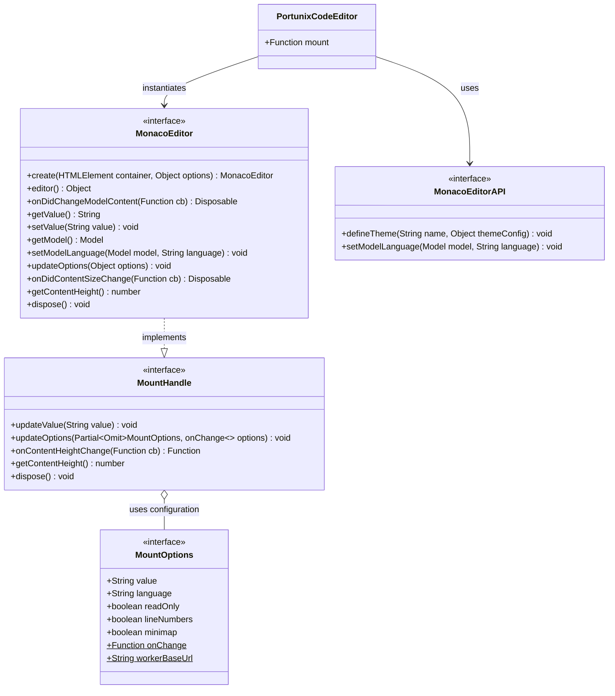

---
references:
  - "File: /src/pilot/ui/components/CodeEditor/monacoLoader.ts"
generationTime: 2026-07-02T14:30:16.403Z
---

```mermaid
classDiagram
    class MountOptions {
        <<interface>>
        +String value
        +String language
        +boolean readOnly
        +boolean lineNumbers
        +boolean minimap
        +Function onChange$
        +String workerBaseUrl$
    }
    
    class MountHandle {
        <<interface>>
        +updateValue(String value) void
        +updateOptions(Partial~Omit~MountOptions, onChange~~ options) void
        +onContentHeightChange(Function cb) Function
        +getContentHeight() number
        +dispose() void
    }
    
    class MonacoEditor {
        <<interface>>
        +create(HTMLElement container, Object options) MonacoEditor
        +editor() Object
        +onDidChangeModelContent(Function cb) Disposable
        +getValue() String
        +setValue(String value) void
        +getModel() Model
        +setModelLanguage(Model model, String language) void
        +updateOptions(Object options) void
        +onDidContentSizeChange(Function cb) Disposable
        +getContentHeight() number
        +dispose() void
    }
    
    class MonacoEditorAPI {
        <<interface>>
        +defineTheme(String name, Object themeConfig) void
        +setModelLanguage(Model model, String language) void
    }
    
    class PortunixCodeEditor {
        +Function mount
    }
    
    MountHandle o-- MountOptions : uses configuration
    PortunixCodeEditor --> MonacoEditor : instantiates
    PortunixCodeEditor --> MonacoEditorAPI : uses
    MonacoEditor ..|> MountHandle : implements
```
