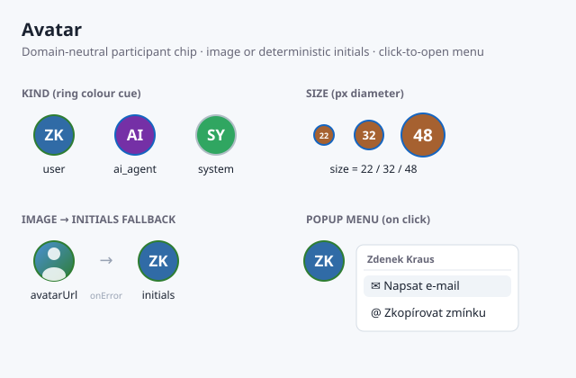

# Avatar

Domain-neutral participant avatar — renders a photo (`avatarUrl`) with a
deterministic **initials fallback**, a coloured **ring cue** for the actor
kind, and a **click-to-open popup menu** with per-actor actions (mail to,
copy `@mention`). Introduced in #100 as part of the venture discussion view
and generalized in #105 into a standalone, dependency-light component that
carries no discussion/venture coupling.



## Usage

```tsx
import { Avatar } from '@cassandragargoyle/pilot-ui';

// Photo with initials fallback and a "Mail to" menu action
<Avatar
    id="user-42"
    displayName="Zdenek Kraus"
    kind="user"
    avatarUrl="https://…/z.png"
    email="zdenek@example.com"
/>

// AI agent, initials-only, larger diameter
<Avatar id="agent-pilot" displayName="Pilot" kind="ai_agent" size={32} />
```

## Props

| Prop          | Type                                | Default | Description                                                        |
| ------------- | ----------------------------------- | ------- | ------------------------------------------------------------------ |
| `id`          | `string`                            | —       | Actor id; seeds the deterministic background hue (stable per id)   |
| `displayName` | `string`                            | —       | Source of the initials fallback and the `@mention` token          |
| `kind`        | `'user' \| 'ai_agent' \| 'system'`  | —       | Drives the ring colour cue                                         |
| `avatarUrl`   | `string`                            | —       | Optional image; falls back to initials on absence or load error   |
| `email`       | `string`                            | —       | Optional address; enables the "Mail to" menu action               |
| `size`        | `number`                            | `22`    | Pixel diameter                                                     |

## Behavior

- **Deterministic colour** — the background hue is hashed from `id`, so the
  same actor always keeps the same colour across renders and sessions
  (palette in `AVATAR_HUES`).
- **Initials** — 1–2 uppercase letters derived from `displayName`: first two
  characters of a single word, or first + last initials of a full name.
- **Graceful image fallback** — a missing or broken `avatarUrl` renders the
  initials chip instead; the image `onError` flips to the fallback at runtime.
- **Ring cue** — the `kind` maps to a coloured ring: `user` (green),
  `ai_agent` (blue), `system` (grey). Colours read from `--opp-*` theme
  variables with literal fallbacks so the component renders correctly outside
  the venture theme.
- **Popup menu** — clicking the chip opens a menu with the display name, an
  optional "Napsat e-mail" (`mailto:`) action when `email` is set, and
  "Zkopírovat zmínku" which copies `@displayName` to the clipboard. Closes on
  outside click or `Escape`.

## Accessibility

The chip is a real `<button>` with `aria-haspopup="menu"`, `aria-expanded`,
and a `title` tooltip; the menu uses `role="menu"` / `role="menuitem"`.
Focus is visible via `:focus-visible`.

## Files

- `Avatar.tsx` — component, initials/hue derivations, popup menu
- `Avatar.css` — chip, ring cue, and popup menu styles (theme-var driven)
- `Avatar.svg` — visual reference (this README's image)
- `Avatar.test.tsx` — unit tests
- `index.ts` — public exports (`Avatar`, `AvatarProps`, `AvatarKind`)
