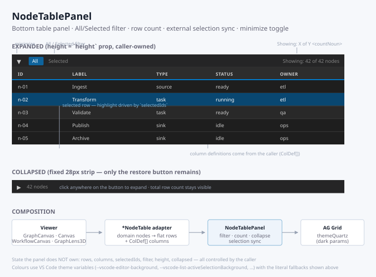

# NodeTablePanel

Shared **bottom table panel** for every Pilot viewer that shows its nodes as a
grid. It wraps [AG Grid](https://www.ag-grid.com/) (`ag-grid-react` /
`ag-grid-community`, dark `themeQuartz`) and adds the parts that used to be
copy-pasted into each viewer: an **All / Selected** filter, a
**"Showing: X of Y"** count, **two-way selection sync** with the viewport, and a
**minimize toggle** that collapses the panel to a 28px strip.

The panel is fully **controlled** — it owns no state of its own. Rows, columns,
selection, filter, height and collapsed flag all come from the caller, so the
viewer stays the single source of truth.



## What it is good for

Use it whenever a viewer needs a tabular view of the same objects it renders
graphically, and the table must stay in sync with the canvas selection:

- **Graph / diagram viewers** — list nodes below the viewport, click a row to
  select the node, click a node to highlight the row
- **Canvas overlays** — any list of addressable items drawn on a canvas
- **Any "objects with a stable id + arbitrary properties" list** — the caller
  flattens its domain objects into rows and supplies `ColDef[]`, so dynamic
  property columns (one per key found across the data) work out of the box

It is deliberately **domain-neutral**: it knows nothing about graphs, workflows
or canvases. It also does not own layout — the resize handle above the panel
belongs to the viewer, which passes the resulting pixel `height` down.

Do **not** use it for editable data grids (rows are read-only), for tables
without a selection model, or as a general-purpose page-level table — it is
styled and sized for the bottom-of-viewport role.

## Current consumers

| Viewer | Adapter | `countNoun` | `rowSelection` |
| --------------- | ---------------------- | ----------- | -------------- |
| `GraphCanvas` | `GraphNodeTable` | `nodes` | `multiple` |
| `WorkflowCanvas` | `WorkflowNodeTable` | `nodes` | `multiple` |
| `Canvas` | `CanvasNodeTable` | `overlays` | caller-chosen |
| `GraphLens3D` | `GraphLensNodeTable` | `nodes` | `single` |

The convention is one thin `*NodeTable` adapter per viewer: it maps domain
objects to flat rows, builds the `ColDef[]`, and renders `NodeTablePanel`.

## Usage

```tsx
import { NodeTablePanel, type TableFilter } from '../NodeTablePanel';

const rows = useMemo(() => nodes.map(nodeToRow), [nodes]);
const columns = useMemo<ColDef[]>(() => [
    { field: 'id', headerName: 'ID', width: 120, sortable: true },
    { field: 'label', headerName: 'Label', width: 150, sortable: true },
], []);

<NodeTablePanel
    rows={rows}
    columns={columns}
    selectedIds={selectedNodeIds}
    filter={filter}
    onFilterChange={setFilter}
    onRowClick={handleNodeClick}
    height={tableHeight}
    collapsed={tableCollapsed}
    onCollapsedChange={setTableCollapsed}
    countNoun="nodes"
    rowSelection="multiple"
/>
```

Single-select viewers pass a one-element `Set` and `rowSelection="single"`;
`ctrlKey` in `onRowClick` is then simply ignored by the caller.

## Props

| Prop | Type | Default | Description |
| ------------------- | ------------------------------- | ------------ | ----------- |
| `rows` | `NodeTableRow[]` | — | All rows, unfiltered; the panel applies the All/Selected filter itself |
| `columns` | `ColDef[]` | — | AG Grid column definitions supplied by the caller |
| `selectedIds` | `Set<string>` | — | External selection state; drives row highlight and the "Selected" filter |
| `filter` | `TableFilter` | — | `'all'` or `'selected'`, owned by the caller |
| `onFilterChange` | `(filter: TableFilter) => void` | — | Fired by the All/Selected buttons |
| `onRowClick` | `(id, ctrlKey) => void` | — | Row click; `ctrlKey` is true for Ctrl/Cmd-click (multi-select callers) |
| `height` | `number` | — | Panel pixel height when expanded (the resize handle lives in the caller) |
| `collapsed` | `boolean` | — | Minimized state, kept per viewer |
| `onCollapsedChange` | `(collapsed: boolean) => void` | — | Fired by the minimize / restore toggle |
| `countNoun` | `string` | `'rows'` | Noun used in "Showing: X of Y &lt;noun&gt;" |
| `rowSelection` | `'single' \| 'multiple'` | `'multiple'` | AG Grid selection mode |
| `getRowId` | `(row) => string` | reads `row.id` | Row identity used for filtering and AG Grid's row id |

Exported types: `TableFilter` (`'all' \| 'selected'`) and `NodeTableRow`
(`Record<string, unknown>`).

## Behavior

- **All / Selected filter** — `'all'` passes `rows` through untouched;
  `'selected'` keeps only rows whose id is in `selectedIds`. The header always
  reports both numbers: `Showing: {filtered} of {total} {countNoun}`.
- **Row click → viewport** — clicking a row calls `onRowClick(id, ctrlKey)`;
  the viewer decides whether that replaces or extends its selection.
  `suppressRowClickSelection` is on, so AG Grid never changes selection by
  itself — the highlight only follows the caller's state.
- **Viewport → row highlight** — an effect walks the grid nodes whenever
  `selectedIds` or the filtered rows change and calls `setSelected(...)` on the
  matching rows, so selecting in the canvas highlights the table and vice versa.
- **Minimize** — when `collapsed` is true the grid is unmounted and only a 28px
  header remains, showing a `▸` chevron and the total row count. Expanded, the
  same button shows `▾`. Both carry `aria-expanded` and a `title` / `aria-label`.
- **Sizing** — AG Grid needs an explicit pixel height, so the grid gets
  `height - 28` (header bar), clamped to a 50px minimum.

## Styling

`NodeTablePanel.css` holds the panel chrome **and** all AG Grid overrides, so
each viewer no longer repeats them. Styles follow the
[GUI Design Principles](../../../../../docs/architecture/GUI-DESIGN-PRINCIPLES.md):
4px spacing grid, VS Code theme variables with literal fallbacks, monochrome
chrome, square corners, 28px header / 26px row height, and a themed scrollbar.

The stylesheet is imported as a string and injected once into `document.head`
under the id `node-table-panel-styles` — this keeps single-file bundles
(`text` loader) working. Under a real `css` loader the import is not a string,
the injection is skipped and the stylesheet is emitted as a sibling file.

## Caveats

- **`getRowId` is not fully wired.** It affects filtering and AG Grid's row id,
  but the click handler and the selection-sync effect read `data.id` directly.
  Rows whose identity is not in an `id` field will filter correctly yet fail to
  report clicks or highlight. Keep an `id` field on rows until this is unified.
- **Column values must be flat.** Nested objects should be JSON-stringified by
  the adapter (see `nodeToRow` in `GraphNodeTable.tsx`).
- **`ModuleRegistry.registerModules([AllCommunityModule])`** runs at import
  time; importing this module is enough to make AG Grid work in the host.

## Files

- `NodeTablePanel.tsx` — component, filter/selection logic, shared theme params
- `NodeTablePanel.css` — panel chrome and AG Grid theme overrides
- `NodeTablePanel.svg` — visual reference (this README's image)
- `index.ts` — public exports (`NodeTablePanel`, `TableFilter`, `NodeTableRow`)

---

**Created**: 2026-08-16
**Last Updated**: 2026-08-16
