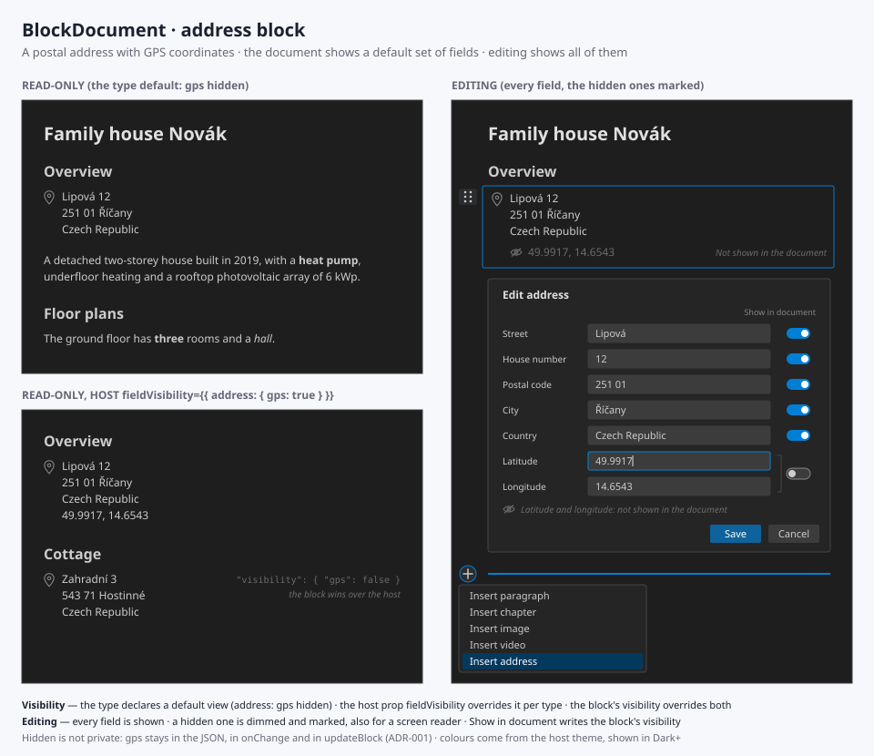

# INT-003 - BlockDocument, an address block with field visibility per block

## Metadata

- **Status**: 📋 Open
- **Type**: enhancement
- **Priority**: medium
- **Created**: 2026-09-26
- **Author**: Zdenek
- **Target**: `src/BlockDocument/`
- **GitHub**: [#3](https://github.com/cassandragargoyle/react-components/issues/3)
- **Related**:
  - [ADR-001 — A block shows a default set of its fields, and the rest only in
    editing](../adr/ADR-001-block-field-visibility.md) — the rule this issue implements
    first
  - [INT-001 — BlockDocument](done/001-block-document.md) — the format and the editing
    functions extended here

## Feature Description

A new block type, `address`: a postal address, with the GPS coordinates of the place when
they are known. The document shows the address, while the coordinates are shown only when
the document is edited. Through the data, meaning the document JSON and `updateBlock`,
they can always be read and written.

To support this, the issue builds the general mechanism that
[ADR-001](../adr/ADR-001-block-field-visibility.md) decides. Every block type declares its
fields and a default view. A host can override the view per type, and the author of a
document can override it per block. Editing shows every field. The address is the first
type that hides something by default, so it is the one the mechanism is proved on.

## Use Case

The family house document starts with where the house is. The reader wants the street and
the city. The application that embeds the document wants the coordinates, to put the house
on a map or to hand them to navigation. A person editing the document needs to see the
coordinates and to correct them.

The same document can be shown by an application that does want the coordinates on the
page, such as an inventory of properties, which sets that once for every address, without
editing a single document.

## Proposed Solution



### The block

```json
{
  "id": "overview-address",
  "type": "address",
  "street": "Lipová",
  "houseNumber": "12",
  "postalCode": "251 01",
  "city": "Říčany",
  "country": "Czech Republic",
  "gps": { "lat": 49.9917, "lon": 14.6543 }
}
```

| Field | Type | Shown by default |
| ----- | ---- | ---------------- |
| `street` | string | yes |
| `houseNumber` | string | yes |
| `postalCode` | string | yes |
| `city` | string | yes |
| `country` | string | yes |
| `gps` | `{ lat: number, lon: number }` | **no** |
| `visibility` | `Record<string, boolean>` | — (the override, [ADR-001](../adr/ADR-001-block-field-visibility.md)) |

The document renders it in an `<address>` element, in the order *street house number*,
*postal code city*, *country*. An empty field leaves no gap or stray separator. When `gps`
is shown, it appears as `49.9917, 14.6543` in decimal degrees.

Judgement calls, open to disagreement before they are built:

- **Every field is optional**, but an address with none of them filled is invalid. A rural
  address has no street (`Lhota 12`), and a place that is being planned may so far have only
  coordinates
- **`houseNumber` is one string.** The Czech *číslo popisné/orientační* is written into it
  as `1234/5` rather than split into two fields. Splitting it is a Czech concern, and the
  component is not tied to one country
- **One fixed layout, no locale formatting.** The order above fits most of Europe. A
  per-country address format is a library of its own and would be a runtime dependency.
  It is left for later, when a document actually needs it
- **`gps` is WGS 84 in decimal degrees**, `lat` in −90..90 and `lon` in −180..180, and is
  validated as such. It is shown as plain text and is not a link to a map. A map link
  would need a provider, and the validation of `href` already limits links to `http:`,
  `https:` and `mailto:`
- **`houseNumber` and `postalCode` are strings**, not numbers: `251 01`, `12a`, `1234/5`

### Field visibility, for every type

As [ADR-001](../adr/ADR-001-block-field-visibility.md) decides:

- Each known type declares its fields with a default visibility. Chapter, paragraph, image
  and video declare all of theirs as visible, so they render exactly as they do today
- `BlockDocument` takes `fieldVisibility?: Partial<Record<string, Record<string, boolean>>>`,
  keyed by block type, which is level 2
- A block may carry `visibility?: Record<string, boolean>`, which is level 3
- The visibility of a field is the block value, else the host value, else the type
  default. A helper `isFieldVisible(block, field, fieldVisibility?)` is exported, so that a
  host can answer the same question the renderer does
- Names that a type does not declare are ignored by the renderer and preserved in the data

### Editing

The address is edited in a form, the same way the image and the video are
(`MediaForm`): *Insert address* in the insert menu, and *Edit address* in the menu of the
block. The form:

- Shows every field, including `gps` as two number inputs, latitude and longitude, each
  with a label
- Marks every field that the document does not show, both visibly and for a screen
  reader, with the text *Not shown in the document*
- Has a *Show in document* switch per field, which writes the block's `visibility`. It
  starts at the value the three levels produce. A switch set back to what the host and type
  levels already give removes its key, so that `visibility` holds only real overrides
- Refuses to save an empty address or coordinates out of range, with a message that names
  the field

In edit mode, the block itself also shows its hidden fields, dimmed and marked the same
way, so that the author sees what the reader will not.

### The data

- `validateBlockDocument` checks the address fields, `gps`, and `visibility` on any block.
  A `visibility` whose value is not a boolean is an error, and one that names an unknown
  field is not
- `BlockPatch` gains the address fields and `visibility`, so that `updateBlock` writes
  `gps` like any other field. Nothing in the editing functions looks at visibility
- `AddressBlock`, `GeoPoint` and `FieldVisibility` are exported from `src/index.ts`
- `schemaVersion` stays at 1. An older component shows an address as an unknown block
  and keeps it, which is how INT-001 treats every type it does not know

### Sample and documentation

- The family house sample gains an address block with coordinates, at the top of its
  *Overview*
- `src/BlockDocument/README.md` documents the address block, `fieldVisibility`, the
  `visibility` key and the rule that hidden is not private, with `AddressBlock.svg` as its
  visual reference

## Acceptance Criteria

- [ ] An `address` block renders in an `<address>` element with street, house number, postal
      code, city and country, and it leaves no stray separator for an empty field
- [ ] In view mode, `gps` is not rendered by default
- [ ] In edit mode, `gps` is rendered on the block and in its form, marked *Not shown in the
      document*
- [ ] `updateBlock(doc, id, { gps })` writes the coordinates, and they are present in the
      document handed to `onChange`, whatever the visibility
- [ ] `fieldVisibility={{ address: { gps: true } }}` shows the coordinates of every address
      in view mode
- [ ] A block's `visibility` overrides both the host and the type default, in both
      directions (`true` and `false`)
- [ ] A field that no level names keeps the type default, and an unknown field name in
      `visibility` is ignored and preserved through an edit
- [ ] The *Show in document* switch writes `visibility`, and switching back to the
      inherited value removes the key
- [ ] The form refuses an empty address and coordinates out of range, and names the field
- [ ] The form is fully keyboard operable. Every input and switch has a label, and the
      hidden marker is announced to a screen reader
- [ ] Chapter, paragraph, image and video render exactly as before (the existing tests
      pass unchanged)
- [ ] `validateBlockDocument` rejects a malformed `gps` and a non-boolean `visibility`
      value, with a path to it, and accepts the family house sample
- [ ] `isFieldVisible`, `AddressBlock`, `GeoPoint` and `FieldVisibility` are exported from
      `src/index.ts`
- [ ] The family house sample contains an address with coordinates, and the demo shows it
- [ ] `README.md` documents the address block and field visibility, including that a
      hidden field is not private
- [ ] `npm run typecheck`, `npm run build` and `npm test` pass
