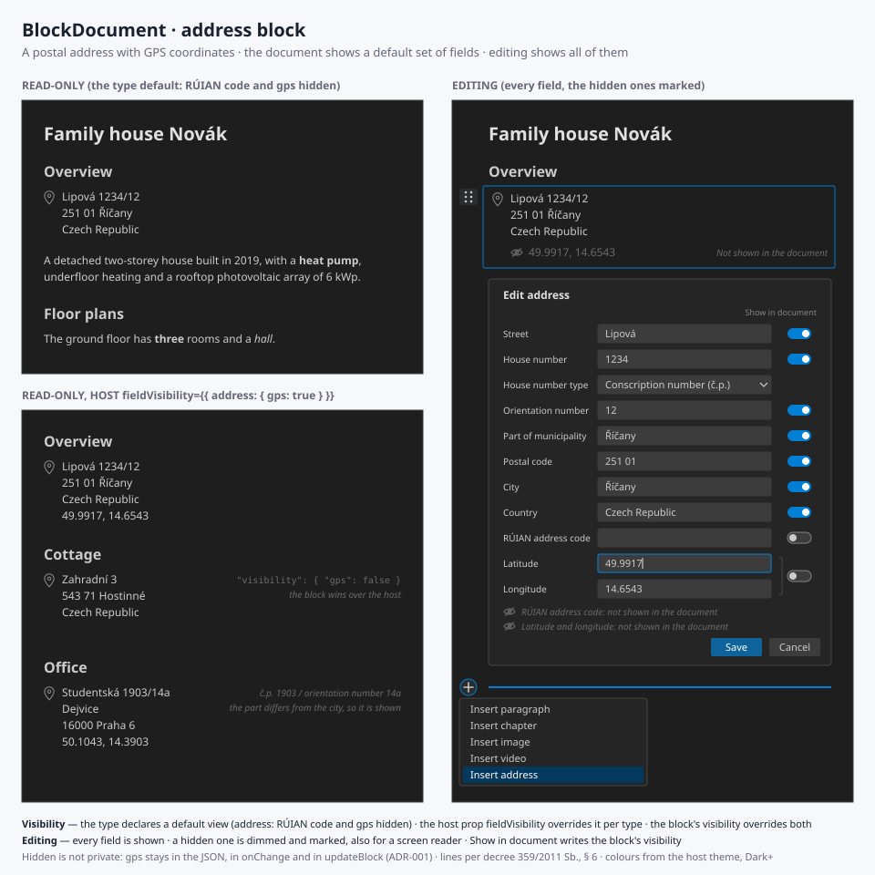

# INT-003 - BlockDocument, an address block with field visibility per block

## Metadata

- **Status**: ✅ Implemented
- **Type**: enhancement
- **Priority**: medium
- **Created**: 2026-09-26
- **Closed**: 2026-09-26
- **Version**: 0.2.1
- **Author**: Zdenek
- **Target**: `src/BlockDocument/`
- **GitHub**: [#3](https://github.com/cassandragargoyle/react-components/issues/3)
- **Related**:
  - [ADR-001 — A block shows a default set of its fields, and the rest only in
    editing](../../adr/ADR-001-block-field-visibility.md) — the rule this issue implements
    first
  - [INT-001 — BlockDocument](001-block-document.md) — the format and the editing
    functions extended here

## Feature Description

A new block type, `address`: a postal address, with the GPS coordinates of the place when
they are known. The document shows the address, while the coordinates are shown only when
the document is edited. Through the data, meaning the document JSON and `updateBlock`,
they can always be read and written.

To support this, the issue builds the general mechanism that
[ADR-001](../../adr/ADR-001-block-field-visibility.md) decides. Every block type declares its
fields and a default view. A host can override the view per type, and the author of a
document can override it per block. Editing shows every field. The address is the first
type that hides something by default, so it is the one the mechanism is proved on.

## Use Case

The family house document starts with where the house is. The reader wants the street and
the city. The application that embeds the document wants the coordinates, to put the house
on a map or to hand them to navigation. A person editing the document needs to see the
coordinates and to correct them.

The same document can be shown by an application that does want the coordinates on the
page, such as an inventory of properties, which sets that once for every address, without
editing a single document.

## Proposed Solution



### The block

```json
{
  "id": "overview-address",
  "type": "address",
  "street": "Lipová",
  "houseNumber": "1234",
  "houseNumberType": "conscription",
  "orientationNumber": "12",
  "municipalityPart": "Říčany",
  "postalCode": "251 01",
  "city": "Říčany",
  "country": "Czech Republic",
  "gps": { "lat": 49.9917, "lon": 14.6543 }
}
```

The fields follow the Czech open formal norm
[OFN Adresy](https://ofn.gov.cz/adresy/2020-07-01/), named in English:

| Field | Type | Shown by default | OFN |
| ----- | ---- | ---------------- | --- |
| `street` | string | yes | `název_ulice` |
| `houseNumber` | string | yes | `číslo_domovní` |
| `houseNumberType` | `'conscription' \| 'registration'` | — | `typ_čísla_domovního` (`č.p.`, `č.ev.`) |
| `orientationNumber` | string, with its letter | yes | `číslo_orientační` + `znak_čísla_orientačního` |
| `municipalityPart` | string | yes | `název_části_obce`, in Prague `název_katastrálního_území` |
| `postalCode` | string | yes | `psč` |
| `city` | string | yes | `název_obce`, in Prague with the district |
| `country` | string | yes | — |
| `ruianCode` | positive integer | **no** | the code of the address place in RÚIAN |
| `gps` | `{ lat: number, lon: number }` | **no** | — |
| `visibility` | `Record<string, boolean>` | — (the override, [ADR-001](../../adr/ADR-001-block-field-visibility.md)) | — |

The document renders it in an `<address>` element, laid out per the Czech decree
[359/2011 Sb., § 6](https://www.zakonyprolidi.cz/cs/2011-359) and its annex 1:

1. street, house number and orientation number after a slash, `Studentská 1903/14a`
2. part of municipality, only when it differs from the city, `Dejvice`
3. postal code and city, `16000 Praha 6`
4. country

Without a street, the numbers follow the part of municipality (`Dolní Adršpach 13`). With
neither, a conscription number reads `č.p. 111`. A registration number always reads
`č.ev. 1`. An empty field leaves no gap or stray separator. When they are shown, `ruianCode`
appears as `RÚIAN 22376925` and `gps` as `49.9917, 14.6543`.

Judgement calls, open to disagreement before they are built:

- **Every field is optional**, but an address with none of them filled is invalid. A place
  that is being planned may so far have only coordinates
- **The Czech numbers are separate fields.** The decree and the OFN distinguish the
  conscription or registration number from the orientation number, and a register lookup
  needs them apart. Storing `1234/12` in one string would lose which part is which. This
  replaces the earlier proposal of a single `houseNumber` string
- **The Czech rules are opt-in by the data.** `houseNumberType` is set only for a Czech
  address, and without it no `č.p.` prefix appears. So an address in Berlin reads as it is
  written. The layout above also fits most of Europe, and a per-country formatter is left
  for later, when a document actually needs one
- **The orientation number keeps its letter**, `14a`, in one field, where the OFN has two.
  A separate input for one letter is a worse form, and the letter never appears on its own
- **`ruianCode` is hidden by default**, like `gps`. It identifies the address place in the
  register for an application, and a reader has no use for it
- **`gps` is WGS 84 in decimal degrees**, `lat` in −90..90 and `lon` in −180..180, and is
  validated as such. It is shown as plain text and is not a link to a map. A map link
  would need a provider, and the validation of `href` already limits links to `http:`,
  `https:` and `mailto:`
- **Numbers and postal codes are strings**, not numbers: `251 01`, `12a`. The postal code is
  kept as written, `16000` or `160 00`

### Field visibility, for every type

As [ADR-001](../../adr/ADR-001-block-field-visibility.md) decides:

- Each known type declares its fields with a default visibility. Image and video declare
  `caption` and `poster` as visible, so they render exactly as they do today. Chapter and
  paragraph declare none, because hiding their only content would hide the block
- `BlockDocument` takes `fieldVisibility?: BlockFieldVisibility`, a map of `FieldVisibility`
  keyed by block type, which is level 2
- A block may carry `visibility?: Record<string, boolean>`, which is level 3
- The visibility of a field is the block value, else the host value, else the type
  default. A helper `isFieldVisible(block, field, fieldVisibility?)` is exported, so that a
  host can answer the same question the renderer does
- Names that a type does not declare are ignored by the renderer and preserved in the data

### Editing

The address is edited in a form, the same way the image and the video are
(`MediaForm`): *Insert address* in the insert menu, and *Edit address* in the menu of the
block. The form:

- Shows every field: the house number type as a choice of *Not specified*, *Conscription
  number (č.p.)* and *Registration number (č.ev.)*, and `gps` as two inputs, latitude and
  longitude, each with a label. A coordinate may be typed with a decimal comma
- Marks every field that the document does not show, both visibly and for a screen
  reader, with the text *Not shown in the document*
- Refuses to save an empty address, coordinates out of range or only one of them, and a
  RÚIAN code that is not a positive whole number, with a message that names the field and
  focus moved to it

In edit mode, the block itself also shows its hidden fields, dimmed and marked the same
way, so that the author sees what the reader will not.

### Block tools: edit and display settings

A selected block, meaning the innermost one under the pointer or holding focus, shows two
buttons on its right, the way its handle shows on its left:

- **Edit** (a pencil) opens the form of an image, a video or an address, and puts the caret
  at the end of a paragraph or a chapter title. An unknown block has none
- **Display settings** (a gear), only on a type that declares fields (image, video,
  address), opens a panel with a *Show in document* switch per declared field. Each switch
  writes the block's `visibility` at once. It starts at the value the three levels produce,
  and one set back to what the host and type levels already give removes its key, so that
  `visibility` holds only real overrides. A field overridden by the block is marked
  *this block*. `Escape` or *Done* closes the panel and returns focus to the gear

Judgement call: **the data and the display are apart.** The form edits what the block
says, and the display settings choose what the document shows of it. So a change of
visibility needs no *Save*, and the form stays the same for every host. The switches
first proposed inside the address form moved to the display settings

### The data

- `validateBlockDocument` checks the address fields, `houseNumberType`, `ruianCode`, `gps`,
  and `visibility` on any block.
  A `visibility` whose value is not a boolean is an error, and one that names an unknown
  field is not
- `BlockPatch` gains the address fields and `visibility`, so that `updateBlock` writes
  `gps` like any other field. Nothing in the editing functions looks at visibility
- `AddressBlock`, `GeoPoint`, `HouseNumberType`, `FieldVisibility` and
  `BlockFieldVisibility` are exported from `src/index.ts`
- `schemaVersion` stays at 1. An older component shows an address as an unknown block
  and keeps it, which is how INT-001 treats every type it does not know

### Sample and documentation

- The family house sample gains an address block with coordinates, at the top of its
  *Overview*
- `src/BlockDocument/README.md` documents the address block, `fieldVisibility`, the
  `visibility` key and the rule that hidden is not private, with `AddressBlock.svg` as its
  visual reference

## Acceptance Criteria

- [x] An `address` block renders in an `<address>` element, and it leaves no stray separator
      for an empty field
- [x] The six samples of annex 1 of decree 359/2011 Sb. are laid out exactly as the annex
      writes them, and an address without `houseNumberType` gets no Czech prefix
- [x] In view mode, `gps` and `ruianCode` are not rendered by default
- [x] In edit mode, `gps` is rendered on the block and in its form, marked *Not shown in the
      document*
- [x] `updateBlock(doc, id, { gps })` writes the coordinates, and they are present in the
      document handed to `onChange`, whatever the visibility
- [x] `fieldVisibility={{ address: { gps: true } }}` shows the coordinates of every address
      in view mode
- [x] A block's `visibility` overrides both the host and the type default, in both
      directions (`true` and `false`)
- [x] A field that no level names keeps the type default, and an unknown field name in
      `visibility` is ignored and preserved through an edit
- [x] A selected block shows *Edit* and, for image, video and address, *Display settings*
      on its right; *Edit* opens the form or puts the caret into the text
- [x] A *Show in document* switch in the display settings writes `visibility` at once, and
      switching back to the inherited value removes the key; the address form has no
      switches
- [x] The form refuses an empty address and coordinates out of range, and names the field
- [x] The form and the display settings are fully keyboard operable. Every input and
      switch has a label, and the hidden marker is announced to a screen reader
- [x] Chapter, paragraph, image and video render exactly as before (the existing tests
      pass unchanged)
- [x] `validateBlockDocument` rejects a malformed `gps`, an unknown `houseNumberType`, a
      `ruianCode` that is not a positive whole number and a non-boolean `visibility` value,
      with a path to it, and accepts the family house sample
- [x] `isFieldVisible`, `AddressBlock`, `GeoPoint`, `HouseNumberType`, `FieldVisibility`
      and `BlockFieldVisibility` are exported from `src/index.ts`
- [x] The family house sample contains an address with coordinates, and the demo shows it
- [x] `README.md` documents the address block and field visibility, including that a
      hidden field is not private
- [x] `npm run typecheck`, `npm run build` and `npm test` pass
