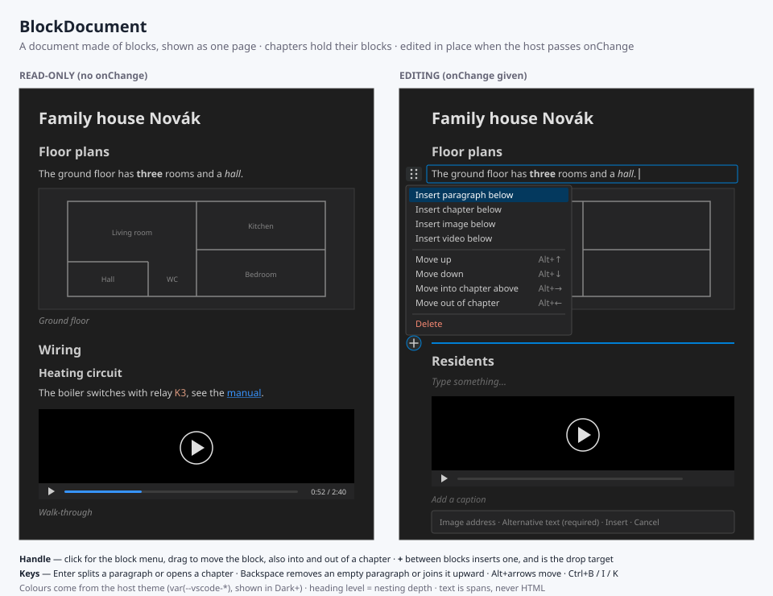

# BlockDocument

A document made of **blocks** — chapters, paragraphs, images, videos — shown as one page and
edited in place, the way Notion does it. The host owns the document; every edit is proposed
to it whole through `onChange`. Specified in
[INT-001](../../docs/issues/001-block-document.md).



## Usage

```tsx
import { useState } from 'react';
import { BlockDocument, validateBlockDocument, type BlockDocumentData } from '@cassandragargoyle/react-components';

export function HouseManual({ json }: { json: unknown }): React.ReactElement {
    const checked = validateBlockDocument(json);
    const [doc, setDoc] = useState<BlockDocumentData | null>(checked.ok ? checked.document : null);
    if (!doc) return <p>{!checked.ok && checked.error}</p>;
    return (
        <BlockDocument
            document={doc}
            onChange={setDoc}                                   // leave out for read-only
            resolveMediaUrl={(src) => `/house-manual/${src}`}
        />
    );
}
```

| Prop | Type | Default | |
| ---- | ---- | ------- | - |
| `document` | `BlockDocumentData` | — | The document to show |
| `onChange` | `(next) => void` | — | Receives the whole new document after each edit; without it the document is read-only |
| `readOnly` | `boolean` | `false` | Read-only even when `onChange` is given |
| `resolveMediaUrl` | `(src) => string` | identity | Maps a stored `src` or `poster` to the URL to load, e.g. a webview URI |
| `createBlockId` | `() => string` | random | Ids for new blocks |
| `className`, `style`, `ref` | | | On the `<article>` |

A document that fails validation is not rendered; the component shows why instead.

## The format

A document file is named `*.blockdocument.json` — the extension the Visual Studio Code
extension recognises it by.

```json
{
  "schemaVersion": 1,
  "id": "family-house-novak",
  "title": "Family house Novák",
  "blocks": [
    {
      "id": "plans",
      "type": "chapter",
      "title": [{ "text": "Floor plans" }],
      "children": [
        { "id": "p1", "type": "paragraph", "text": [{ "text": "Three " }, { "text": "rooms", "bold": true }] },
        { "id": "i1", "type": "image", "src": "plans/ground-floor.svg", "alt": "Ground floor plan", "caption": [{ "text": "Ground floor" }] }
      ]
    },
    { "id": "v1", "type": "video", "src": "media/tour.mp4", "poster": "media/tour.jpg" }
  ]
}
```

| Block | Fields |
| ----- | ------ |
| `chapter` | `title`, `children` — a heading whose level is its depth (`h2` at the top, down to `h6`) |
| `paragraph` | `text` |
| `image` | `src`, `alt` (required, not empty), `caption?` |
| `video` | `src`, `poster?`, `caption?` — the browser's native controls |

- Text is an array of spans `{ text, bold?, italic?, code?, href? }` and never HTML. A link is
  rendered only for `http:`, `https:` and `mailto:`
- Block ids are unique across the whole document
- A block of an unknown type is shown as a placeholder and kept through every edit
- `schemaVersion` newer than the component's is refused rather than guessed at

## Editing

| | Mouse | Keyboard |
| - | ----- | -------- |
| Edit text | click into it | — |
| Bold, italic, link | — | `Ctrl+B`, `Ctrl+I`, `Ctrl+K` |
| Block menu | the handle left of a block | `Tab` to the handle, `Enter` |
| Insert a block | `+` between blocks, or the menu | the menu; `Enter` at the end of a paragraph |
| Open a chapter | — | `Enter` in its title adds its first paragraph |
| Split, join | — | `Enter` mid-paragraph; `Backspace` at its start |
| Delete | the menu | the menu; `Backspace` in an empty paragraph |
| Move | drag the handle, also into and out of a chapter | `Alt+↑` / `Alt+↓`; `Alt+→` into the chapter above, `Alt+←` out |

Pasted text comes in as plain text. Undo and redo belong to the host, which holds the
history of documents it was given.

## Editing without the component

The edits are exported as pure functions, for a host that changes a document itself:

```ts
import { insertBlock, moveBlock, removeBlock, updateBlock, canMoveBlock } from '@cassandragargoyle/react-components';

const next = moveBlock(doc, 'p1', { parentId: 'plans', index: 0 }); // index counted after taking p1 out
```

They never mutate their input, and throw on an unknown id, a taken id, or a chapter moved into
itself (`canMoveBlock` asks first).

## Demo

`npm run dev` serves the family house at <http://127.0.0.1:5173/demo/>, editable, with a light
and a dark theme; in Visual Studio Code, **Run and Debug → Demo: BlockDocument in Chrome**
starts the same with breakpoints in `src/`. The sample lives in `samples/`; its video is not
committed, see `samples/media/README.md`.

## Files

- `BlockDocument.tsx` — the component and its props
- `BlockView.tsx` — blocks, handles, menus and insertion gaps
- `EditableText.tsx` — rich text edited in place
- `editor.ts` — the actions blocks call, and focus hand-over after an edit
- `operations.ts` — the edits as pure functions
- `validate.ts` — `validateBlockDocument`, `isBlockDocument`
- `richText.ts`, `richTextDom.ts` — spans, links, the DOM round trip and the caret
- `types.ts` — the format
- `samples/` — the family house document (`family-house.blockdocument.json`), its plans and poster
- `BlockDocument.svg` — visual reference (this README's image)
