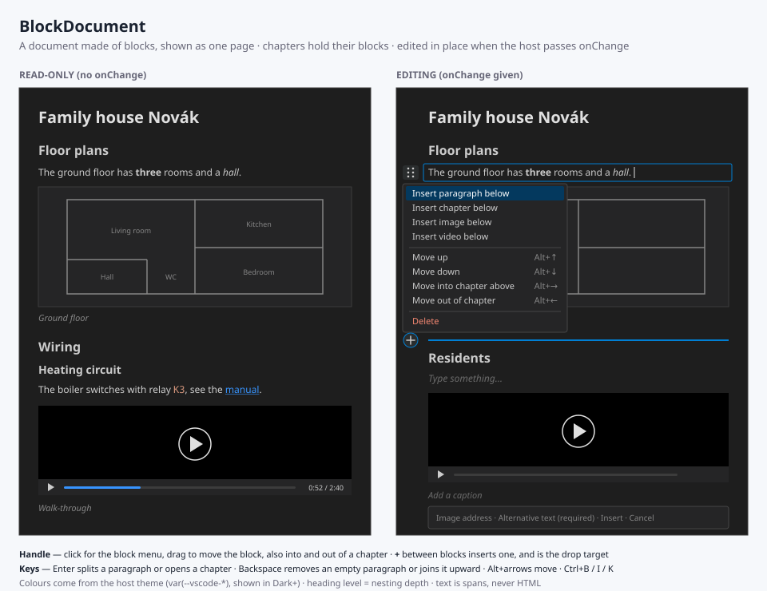

# BlockDocument

A document made of **blocks** — chapters, paragraphs, images, videos, addresses — shown as
one page and edited in place, the way Notion does it. The host owns the document; every edit
is proposed to it whole through `onChange`. Specified in
[INT-001](../../docs/issues/done/001-block-document.md) and
[INT-003](../../docs/issues/003-address-block.md).



## Usage

```tsx
import { useState } from 'react';
import { BlockDocument, validateBlockDocument, type BlockDocumentData } from '@cassandragargoyle/react-components';

export function HouseManual({ json }: { json: unknown }): React.ReactElement {
    const checked = validateBlockDocument(json);
    const [doc, setDoc] = useState<BlockDocumentData | null>(checked.ok ? checked.document : null);
    if (!doc) return <p>{!checked.ok && checked.error}</p>;
    return (
        <BlockDocument
            document={doc}
            onChange={setDoc}                                   // leave out for read-only
            resolveMediaUrl={(src) => `/house-manual/${src}`}
        />
    );
}
```

| Prop | Type | Default | |
| ---- | ---- | ------- | - |
| `document` | `BlockDocumentData` | — | The document to show |
| `onChange` | `(next) => void` | — | Receives the whole new document after each edit; without it the document is read-only |
| `readOnly` | `boolean` | `false` | Read-only even when `onChange` is given |
| `resolveMediaUrl` | `(src) => string` | identity | Maps a stored `src` or `poster` to the URL to load, e.g. a webview URI |
| `createBlockId` | `() => string` | random | Ids for new blocks |
| `fieldVisibility` | `BlockFieldVisibility` | — | Which fields the document shows, per block type, e.g. `{ address: { gps: true } }`; see [Field visibility](#field-visibility) |
| `className`, `style`, `ref` | | | On the `<article>` |

A document that fails validation is not rendered; the component shows why instead.

## The format

A document file is named `*.blockdocument.json` — the extension the Visual Studio Code
extension recognises it by.

```json
{
  "schemaVersion": 1,
  "id": "family-house-novak",
  "title": "Family house Novák",
  "blocks": [
    {
      "id": "plans",
      "type": "chapter",
      "title": [{ "text": "Floor plans" }],
      "children": [
        { "id": "p1", "type": "paragraph", "text": [{ "text": "Three " }, { "text": "rooms", "bold": true }] },
        { "id": "i1", "type": "image", "src": "plans/ground-floor.svg", "alt": "Ground floor plan", "caption": [{ "text": "Ground floor" }] }
      ]
    },
    { "id": "v1", "type": "video", "src": "media/tour.mp4", "poster": "media/tour.jpg" }
  ]
}
```

| Block | Fields |
| ----- | ------ |
| `chapter` | `title`, `children` — a heading whose level is its depth (`h2` at the top, down to `h6`) |
| `paragraph` | `text` |
| `image` | `src`, `alt` (required, not empty), `caption?` |
| `video` | `src`, `poster?`, `caption?` — the browser's native controls |
| `address` | see [The address](#the-address) |

Any block may carry `visibility`, see [Field visibility](#field-visibility).

- Text is an array of spans `{ text, bold?, italic?, code?, href? }` and never HTML. A link is
  rendered only for `http:`, `https:` and `mailto:`
- Block ids are unique across the whole document
- A block of an unknown type is shown as a placeholder and kept through every edit
- `schemaVersion` newer than the component's is refused rather than guessed at

## The address

A postal address, laid out per the Czech decree
[359/2011 Sb., § 6](https://www.zakonyprolidi.cz/cs/2011-359), with the fields of the
[OFN Adresy](https://ofn.gov.cz/adresy/2020-07-01/). The same layout fits most of Europe; the
Czech rules apply only where the Czech fields are filled.

```json
{
  "id": "overview-address",
  "type": "address",
  "street": "Studentská",
  "houseNumber": "1903",
  "houseNumberType": "conscription",
  "orientationNumber": "14a",
  "municipalityPart": "Dejvice",
  "postalCode": "16000",
  "city": "Praha 6",
  "country": "Czech Republic",
  "gps": { "lat": 50.1043, "lon": 14.3903 }
}
```

| Field | Shown by default | |
| ----- | ---------------- | - |
| `street` | yes | |
| `houseNumber` | yes | The building number; in Czechia the conscription or registration number |
| `houseNumberType` | — | `conscription` (`č.p.`) or `registration` (`č.ev.`); set only for a Czech address |
| `orientationNumber` | yes | The Czech orientation number with its letter, written after the house number: `1903/14a` |
| `municipalityPart` | yes | The part of the municipality, in Prague the cadastral area; left out when it equals `city` |
| `postalCode` | yes | As written, `16000` or `160 00` |
| `city` | yes | In Prague with the district, `Praha 6` |
| `country` | yes | |
| `ruianCode` | **no** | The code of the address place in RÚIAN, the Czech register of addresses |
| `gps` | **no** | `{ lat, lon }`, WGS 84 in decimal degrees |

Every field is optional, but an address with none filled is invalid. The lines are:

1. street with the numbers, `Studentská 1903/14a`
2. the part of the municipality, `Dejvice`, only when it differs from the city
3. postal code and city, `16000 Praha 6`
4. country

Without a street the numbers follow the part of the municipality, `Dolní Adršpach 13`; with
neither, a conscription number reads `č.p. 111`. A registration number always reads
`č.ev. 1`. An empty field leaves no gap and an empty line no line.

## Field visibility

Each block type declares which of its fields the document shows (ADR-001). The address hides
`ruianCode` and `gps`; images and videos show `caption` and `poster`. Two levels override that
default, and the more specific one wins:

- the host, for every block of a type: `fieldVisibility={{ address: { gps: true } }}`
- the block, for itself: `"visibility": { "gps": true, "country": false }`

An override is a map of field names to booleans: a field it does not name keeps the value from
the level below, and a name the type does not know is ignored and kept. `isFieldVisible(block,
field, fieldVisibility)` answers the question the renderer asks.

**Editing shows every field.** A hidden field is dimmed and marked *Not shown in the document*,
also for a screen reader, and the address form sets the block's `visibility` with a *Show in
document* switch per field.

**Hidden is not private.** A hidden field stays in the document, in what `onChange` receives
and in what `updateBlock` writes. An application that must not disclose the coordinates removes
them from the data before passing the document on.


## Editing

| | Mouse | Keyboard |
| - | ----- | -------- |
| Edit text | click into it | — |
| Bold, italic, link | — | `Ctrl+B`, `Ctrl+I`, `Ctrl+K` |
| Block menu | the handle left of a block | `Tab` to the handle, `Enter` |
| Insert a block | `+` between blocks, or the menu | the menu; `Enter` at the end of a paragraph |
| Edit an image, video or address | the menu, *Edit …* | the menu |
| Open a chapter | — | `Enter` in its title adds its first paragraph |
| Split, join | — | `Enter` mid-paragraph; `Backspace` at its start |
| Delete | the menu | the menu; `Backspace` in an empty paragraph |
| Move | drag the handle, also into and out of a chapter | `Alt+↑` / `Alt+↓`; `Alt+→` into the chapter above, `Alt+←` out |

Pasted text comes in as plain text. Undo and redo belong to the host, which holds the
history of documents it was given.

## Editing without the component

The edits are exported as pure functions, for a host that changes a document itself:

```ts
import { insertBlock, moveBlock, removeBlock, updateBlock, canMoveBlock } from '@cassandragargoyle/react-components';

const next = moveBlock(doc, 'p1', { parentId: 'plans', index: 0 }); // index counted after taking p1 out
```

They never mutate their input, and throw on an unknown id, a taken id, or a chapter moved into
itself (`canMoveBlock` asks first).

## Demo

`npm run dev` serves the family house at <http://127.0.0.1:5173/demo/>, editable, with a light
and a dark theme and a switch that shows the address coordinates through `fieldVisibility`.
The query sets the starting state: `?block=<id>` scrolls to a block, and `?readonly`,
`?light` and `?gps` start read-only, in the light theme, and with the coordinates shown.

In Visual Studio Code, **Run and Debug** offers:

| Target | |
| ------ | - |
| *Demo: BlockDocument in Chrome* (or *in Edge*) | The demo, with breakpoints in `src/` |
| *Demo: address block in Chrome* | The demo scrolled to the address, its GPS shown (`?block=overview-address&gps`) |
| *Tests: address and field visibility* | The address layout, field visibility and the address form, under the debugger |
| *Tests: the current file*, *Tests: all* | Vitest under the debugger |

The demo targets start the Vite server as a task, which keeps running after the session ends.
The sample lives in `samples/`; its video is not committed, see `samples/media/README.md`.

## Files

- `BlockDocument.tsx` — the component and its props
- `BlockView.tsx` — blocks, handles, menus and insertion gaps
- `MediaForm.tsx`, `AddressForm.tsx` — the forms that insert and edit an image, a video, an address
- `address.ts` — the address fields, their layout and checks
- `fields.ts` — field visibility: the fields each type declares, `isFieldVisible`
- `EditableText.tsx` — rich text edited in place
- `editor.ts` — the actions blocks call, and focus hand-over after an edit
- `operations.ts` — the edits as pure functions
- `validate.ts` — `validateBlockDocument`, `isBlockDocument`
- `richText.ts`, `richTextDom.ts` — spans, links, the DOM round trip and the caret
- `types.ts` — the format
- `samples/` — the family house document (`family-house.blockdocument.json`), its plans and poster
- `BlockDocument.svg` — visual reference (this README's image)
- `AddressBlock.svg` — visual reference of the address and field visibility
