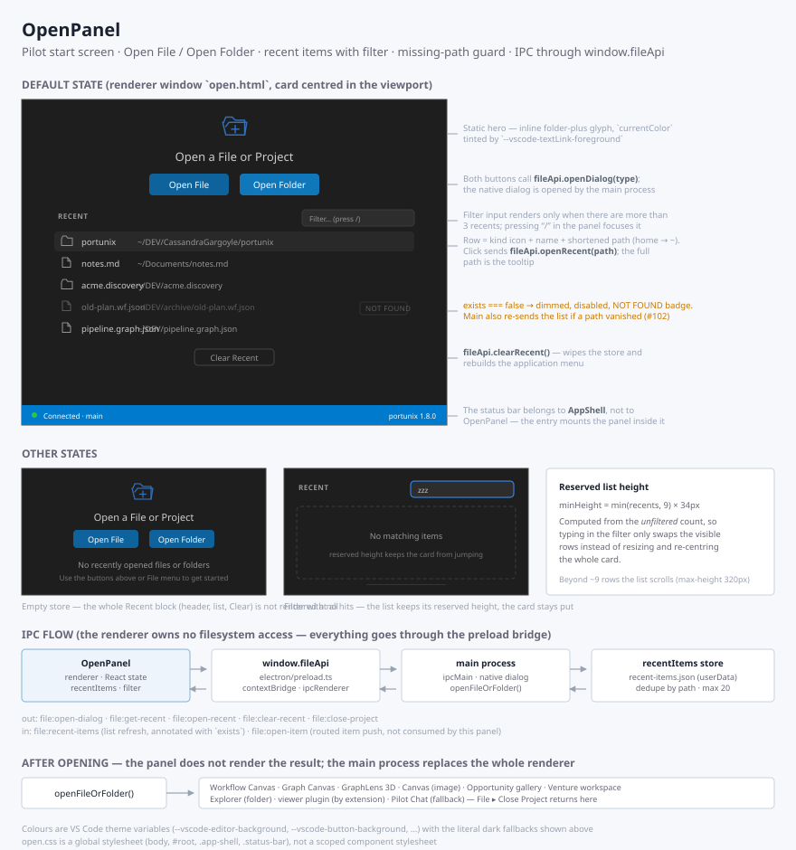

# OpenPanel

A **launcher screen**: a centred card with **Open File** / **Open Folder** buttons and a
filterable list of **recently opened** items. It fits the "nothing is open yet" screen of a
desktop app or a webview — the panel starts an action and the host decides what happens next.

The panel is host-neutral. It keeps no list of its own and calls no platform API: the
recent items come in through `recentItems`, and every action goes out through a callback.
It came from Pilot, the `portunix-vscode` desktop app (#014, missing paths in #102), where a
thin wrapper binds it to the Electron preload bridge.



## Usage

```tsx
import { OpenPanel, type OpenPanelRecentItem } from '@cassandragargoyle/react-components';

function StartScreen({ host }: { host: MyHost }): React.ReactElement {
    const [items, setItems] = useState<OpenPanelRecentItem[] | null>(null);

    useEffect(() => host.loadRecent().then(setItems), [host]);

    return (
        <OpenPanel
            recentItems={items ?? []}
            loading={items === null}
            onOpenFile={() => host.pick('file')}
            onOpenFolder={() => host.pick('folder')}
            onOpenRecent={item => host.open(item.path)}
            onClearRecent={() => host.clearRecent().then(() => setItems([]))}
        />
    );
}
```

A button whose callback is omitted is not rendered, so a host that opens only folders
passes only `onOpenFolder`.

## Props

| Prop | Type | Default | Description |
| ---- | ---- | ------- | ----------- |
| `recentItems` | `readonly OpenPanelRecentItem[]` | — | The recent list, most recent first; the panel only filters it |
| `onOpenFile` | `() => void` | — | Open File button; hidden when omitted |
| `onOpenFolder` | `() => void` | — | Open Folder button; hidden when omitted |
| `onOpenRecent` | `(item) => void` | — | A click on a recent row that exists |
| `onClearRecent` | `() => void` | — | Clear Recent button; hidden when omitted |
| `loading` | `boolean` | `false` | Shows *Loading recent items...* instead of the empty state |
| `filterThreshold` | `number` | `3` | The filter input appears above this many items |
| `formatPath` | `(path) => string` | `shortenHomePath` | Display form of a path; the tooltip keeps the full path |
| `labels` | `Partial<OpenPanelLabels>` | English | Override of any visible string |
| `icon` | `ReactNode` | folder-plus | The icon above the title; `null` hides it |
| `className`, `style` | | — | Applied to the root `.open-panel` element |

A recent item:

```ts
interface OpenPanelRecentItem {
    type: 'file' | 'folder';   // drives the row icon
    path: string;              // key, tooltip and filter haystack
    name: string;              // bold display name
    lastOpened?: string;       // carried for the host, not rendered
    exists?: boolean;          // false → dimmed, disabled, "Not found"
}
```

`DEFAULT_OPEN_PANEL_LABELS` and `shortenHomePath` are exported too, for a host that wants
to extend the defaults rather than replace them.

## Behavior

- **Filter** — case-insensitive substring match against `name` **and** `path`. Pressing
  `/` anywhere in the panel (outside an input) focuses the filter. No hits shows
  *No matching items*.
- **Stable height** — the list reserves `min(items, 9) × 34px` from the **unfiltered**
  count, so typing does not resize and re-centre the card. It scrolls past 320px.
- **Missing paths** — an item with `exists === false` is dimmed and disabled, with a
  *Not found* badge and a `"<path> (not found)"` tooltip; a click does nothing.
- **Path shortening** — `shortenHomePath` replaces a leading `/home/<user>`,
  `/Users/<user>` or `C:\Users\<user>` with `~`.
- **Empty and loading** — with no items the panel shows the empty state, or the loading
  line while `loading` is true, in a `role="status"` region.

## Styling

The stylesheet is injected once on first use and scoped to `.open-panel-*` classes; it does
not touch `body` or any page layout. The root fills its parent's height (`height: 100%`),
so give the parent a height. Colours read the VS Code theme variables
(`--vscode-button-background`, `--vscode-textLink-foreground`, `--vscode-input-*`,
`--vscode-descriptionForeground`, `--vscode-list-hoverBackground`, …) with dark-theme
fallbacks, and every interactive element has a `:focus-visible` outline.

## Files

- `OpenPanel.tsx` — the component, its props and the default labels
- `OpenPanel.css` — scoped stylesheet
- `OpenPanel.test.tsx` — unit tests
- `OpenPanel.svg` — visual reference (this README's image)
- `index.ts` — public exports

---

**Created**: 2026-08-16
**Last Updated**: 2026-09-26
